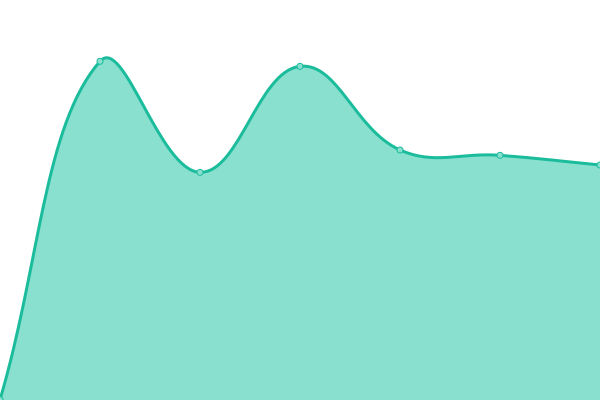
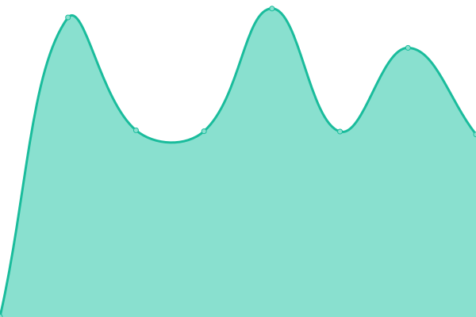

# [📈 Live Status](https://stats.felt.blue): <!--live status--> **🟧 Partial outage**

This repository contains the open-source uptime monitor and status page for [qwerzl](https://stats.felt.blue), powered by [Upptime](https://github.com/upptime/upptime).

With [Upptime](https://upptime.js.org), you can get your own unlimited and free uptime monitor and status page, powered entirely by a GitHub repository. We use [Issues](https://github.com/qwerzl/upptime/issues) as incident reports, [Actions](https://github.com/qwerzl/upptime/actions) as uptime monitors, and [Pages](https://stats.felt.blue) for the status page.

<!--start: status pages-->
<!-- This summary is generated by Upptime (https://github.com/upptime/upptime) -->
<!-- Do not edit this manually, your changes will be overwritten -->
<!-- prettier-ignore -->
| URL | Status | History | Response Time | Uptime |
| --- | ------ | ------- | ------------- | ------ |
|  [Homepage](https://felt.blue) | 🟩 Up | [homepage.yml](https://github.com/qwerzl/upptime/commits/HEAD/history/homepage.yml) | 

 319ms
     
 | 

<a href="https://stats.felt.blue/history/homepage">100.00%</a>
    

|  [Nextcloud](https://nc.felt.blue) | 🟩 Up | [nextcloud.yml](https://github.com/qwerzl/upptime/commits/HEAD/history/nextcloud.yml) | 

 3025ms
     
 | 

<a href="https://stats.felt.blue/history/nextcloud">99.57%</a>
    

|  [Notea](https://notes.felt.blue) | 🟥 Down | [notea.yml](https://github.com/qwerzl/upptime/commits/HEAD/history/notea.yml) | 

 761ms
     
 | 

<a href="https://stats.felt.blue/history/notea">49.01%</a>
    

<!--end: status pages-->

[**Visit our status website →**](https://stats.felt.blue)

## 📄 License

- Powered by: [Upptime](https://github.com/upptime/upptime)
- Code: [MIT](./LICENSE) © [qwerzl](https://stats.felt.blue)
- Data in the `./history` directory: [Open Database License](https://opendatacommons.org/licenses/odbl/1-0/)
